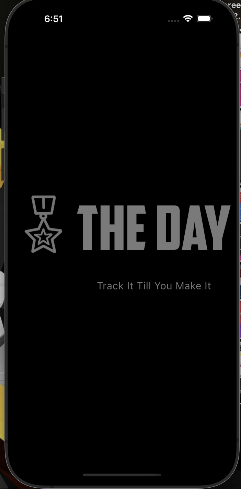
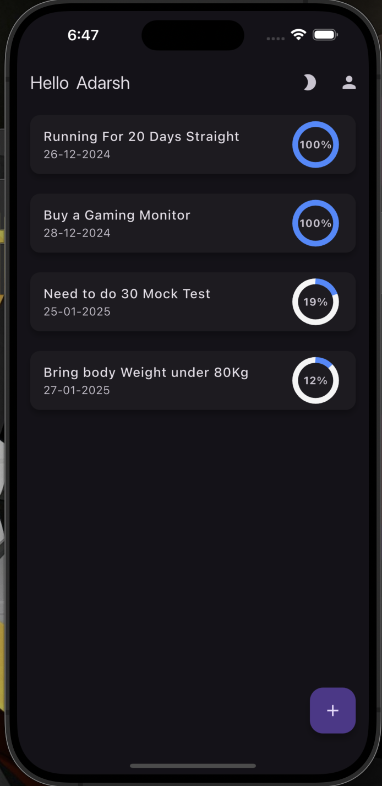
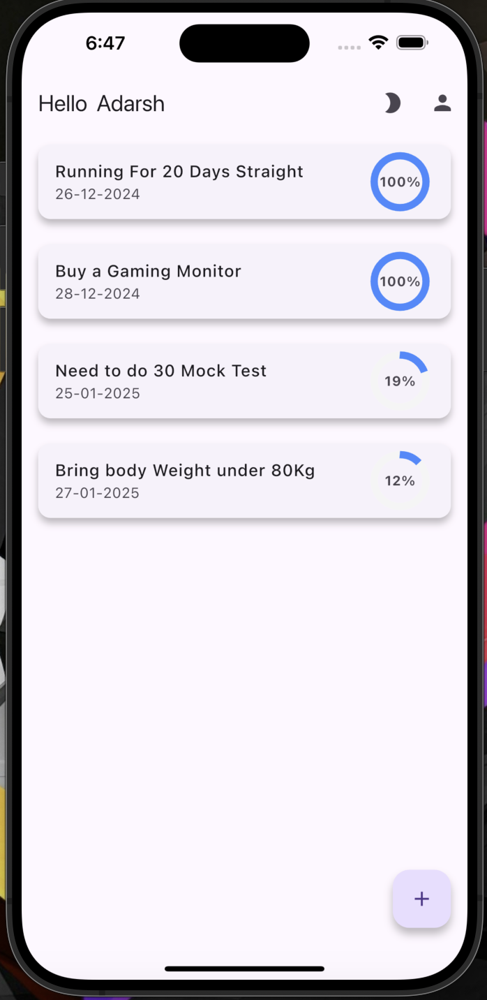
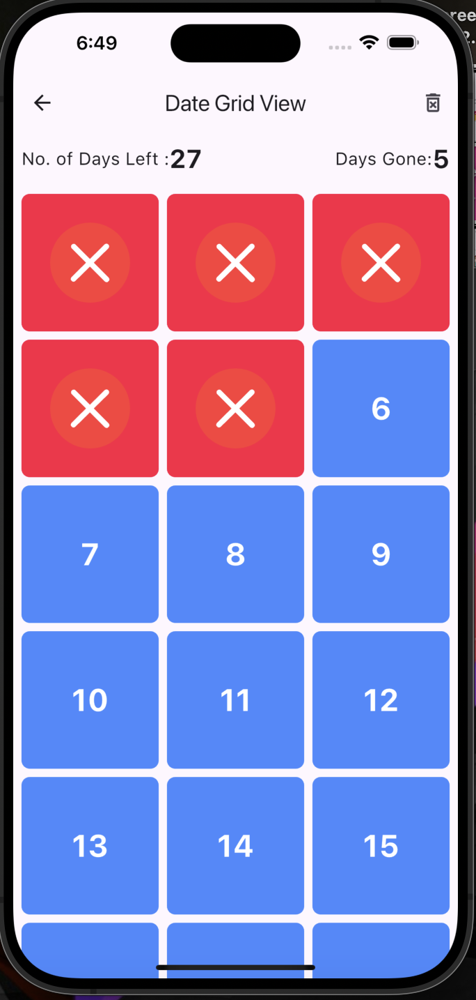

# The Day - Goal Tracker App

The Day is a simple and intuitive 🐦 Flutter application that allows users to set and track their 🎯 goals effectively. The app provides 📧 email and 🌐 Google authentication to ensure user data 🔒 security and privacy. 🎯 Goals and their corresponding 📅 finish dates are stored in ☁️ Firebase Firestore, enabling real-time ⏱️ synchronization and persistent storage.


## ✨ Features

- **👤 User Authentication:**
  - 📧 Email-based authentication
  - 🌐 Google Sign-In integration

- **🎯 Goal Management:**
  - ✏️ Define 🎯 goals with specific 📅 finish dates
  - 👀 View 🗓️ days left to achieve 🎯 goals
  - 🔢 Track the number of 🕒 days gone since 🎯 goal creation

- **☁️ Firebase Integration:**
  - 🔒 Secure storage of 🎯 goals and user data in ☁️ Firebase Firestore
  - ⏱️ Real-time updates and synchronization

- **🎭 Interactive Experience:**
  - 🎥 Visual feedback for ✅ completed or ❌ missed 🎯 goals using 📽️ animations

## ⚙️ Installation

1. 📂 Clone the repository:
   ```bash
   git clone https://github.com/Abhay-Kumar-Dubey/The-Day
   ```
2. 📁 Navigate to the project directory:
   ```bash
   cd The-Day
   ```
3. 📥 Install the dependencies:
   ```bash
   flutter pub get
   ```
4. ⚙️ Set up ☁️ Firebase for your project:
   - Create a ☁️ Firebase project in the [Firebase Console](https://console.firebase.google.com/).
   - Add your 🤖 Android and 🍎 iOS apps to the ☁️ Firebase project.
   - 📥 Download the `google-services.json` (for 🤖 Android) and `GoogleService-Info.plist` (for 🍎 iOS) files and place them in the respective directories of your 🐦 Flutter project.
   - ✅ Enable Firestore and authentication (📧 Email and 🌐 Google) in the ☁️ Firebase Console.
5. ▶️ Run the app:
   ```bash
   flutter run
   ```

## 🖼️ Screenshots

<div align="center">
  <figure>
    
    <figcaption>Splash Screen.</figcaption>
  </figure>
  
  <figure>
    
    <figcaption>Home Screen Dark Theme</figcaption>
  </figure>
   <br>
  <figure>
    
    <figcaption>Home Screen Light Theme</figcaption>
  </figure>
   
  <figure>
    
    <figcaption>List of Days</figcaption>
  </figure>
</div>


## 🛠️ Tech Stack

- **Frontend:** 🐦 Flutter
- **Backend:** ☁️ Firebase Firestore
- **Authentication:** 🔒 Firebase Authentication

## 🧭 How It Works

1. **👤 Authentication:**
   - 🆕 New users can 📝 sign up using their 📧 email or 🌐 Google account.
   - 👥 Existing users can 🔑 log in to access their 🎯 goals.

2. **🎯 Goal Management:**
   - Users can ➕ add a new 🎯 goal by specifying a 🏷️ name and 📅 finish date.
   - 🎯 Goals are displayed with the number of 🗓️ days left until the 📅 finish date.

3. **📊 Tracking Progress:**
   - Users can 👀 monitor the 📊 progress of their 🎯 goals with ⏱️ real-time updates.
   - Upon ✅ completion or ❌ expiry, 📽️ animations provide a 🎨 visual indication of the result.

## 🤝 Contributing

Contributions are welcome! Please follow these steps:

1. 🍴 Fork the repository.
2. 🛠️ Create a new branch for your 🆕 feature or 🐛 bugfix:
   ```bash
   git checkout -b feature-name
   ```
3. 💾 Commit your changes:
   ```bash
   git commit -m "Add 🆕 feature/🐛 bugfix"
   ```
4. 🔄 Push to your branch:
   ```bash
   git push origin feature-name
   ```
5. 📤 Create a pull request.

## 📜 License

This project is licensed under the 📝 MIT License. See the `LICENSE` file for more details.

## 📬 Contact

For ❓ questions or 💬 feedback, feel free to 📧 reach out:

- **📧 Email:** abhay.dubey.ug22@nsut.ac.in
- **🐱 GitHub:** [Abhay-Kumar-Dubey](https://github.com/Abhay-Kumar-Dubey)

